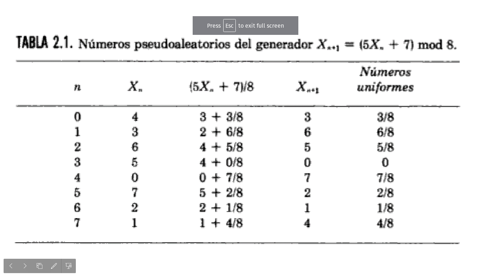
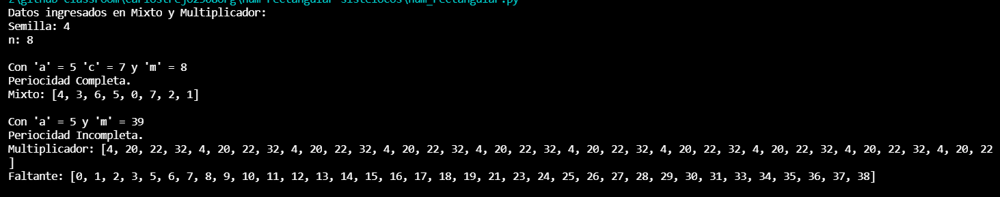
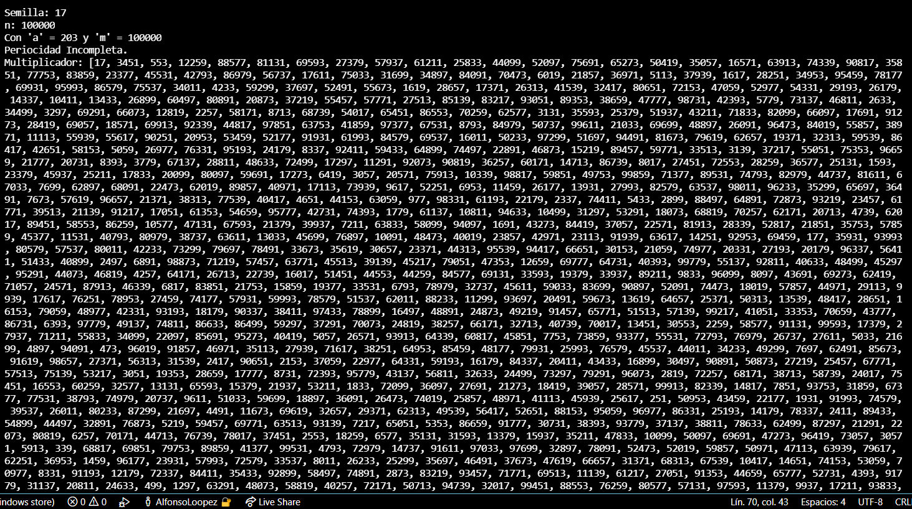
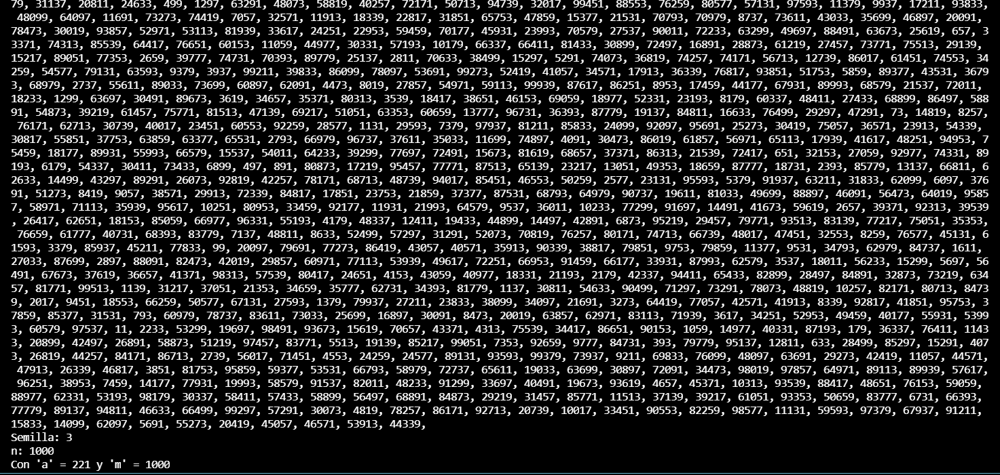
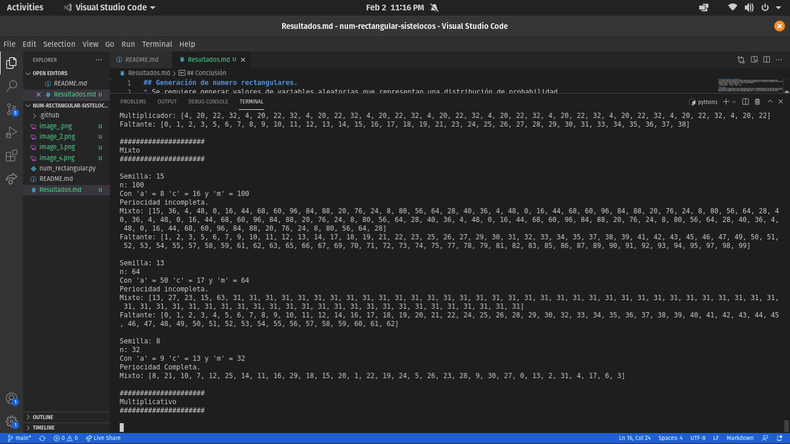

## Generación de numero rectangulares.
* Se requiere generar valores de variables aleatorias que representan una distribución de probabilidad.
* En el cual los números aleatorios a través de relaciones matemáticas de recurrencia​ Congruencial lineal​ Existe el mixto y multiplicativo el cual cada uno tiene caracteristicas propias. :
- Mixto:  X(n+1) = (axn +c ) mod m
- Multiplicativo :  X(n+1) = (axn ) mod m

## Resultados.
* De acuerdo a lo explicado en clase se pudo observar que los resultados obtenidos en el programa son identicos , lo cual podemos concluir que se aplicó de forma correcta las formulas para poder simular la situación que se planteo, como también se pudo observar que entre mas grande sea m es probable tener muchas cantidades aleatorias , el cual es muy extenso ver dichos números.

## Conclusión
Es importante simular situaciones en las que nos pueda tomar mas tiempo, ya sea realizando cálculos puesto que en el trascurso de hacerlos a mano se podría cometer un error y por ende se necesita tiempo para terminar una situación fácil.

